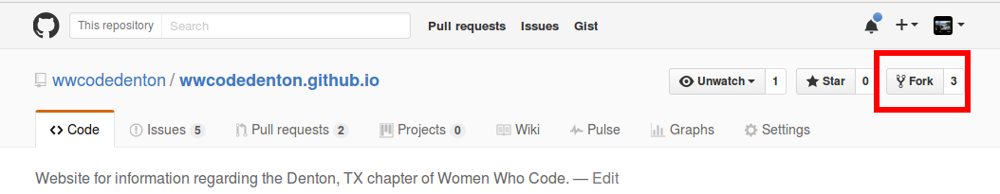
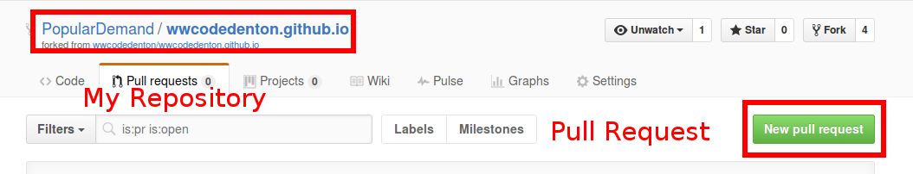

# Contributing

When contributing to this repository, please first discuss the change you wish to make via issue before making a change. 

Please note we have a code of conduct, please follow it in all your interactions with the project.

## Pull Request Process

1. Check out the [open issues](https://github.com/wwcodedenton/wwcodedenton.github.io/issues) and find one you want to work on.
2. Comment on the issue you'd like to work on. If someone is already working on the same issue, find them and collaborate!
3. Fork the repo. (Top right of the screen)
  
  Now you have a copy at www.github.com/YOURUSERNAME/REPONAME
4. Clone the copy to your local machine. From your terminal: `$ git clone https://github.com/YOURUSERNAME/REPONAME.git`
  (You'll need to have git installed for this step.)
6. Get your changes pushed up to your remote. `$ git push origin master`
7. From YOUR REPO, navigate to the "Pull Requests" tab and open a pull request.
  
8. In the comments, leave a note about which number issue you worked on.
9. Submit

That's enough for Hacktoberfest shirt, but if you'd like to become a long term member of this site's upkeep, and all of Women Who Code Denton's repositories, mention it in your PR and I'll add you as a permanent collaborator.

## Code of Conduct

As always, follow the code of conduct oulined [here](https://github.com/wwcodedenton/guidelines-resources/blob/master/code_of_conduct.md).
